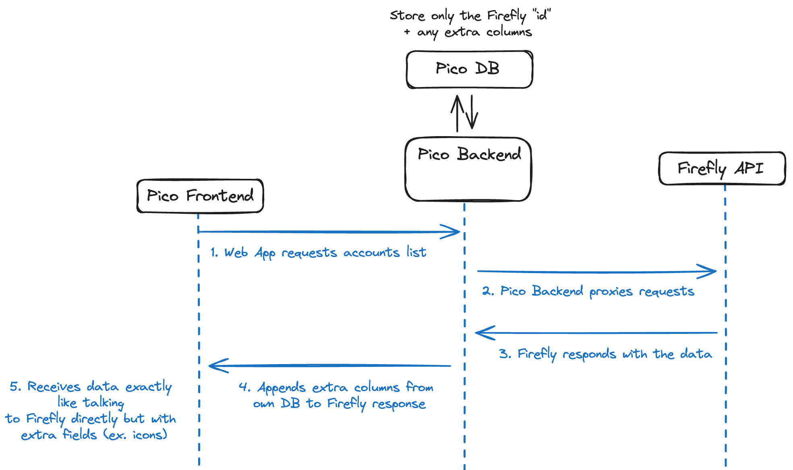

## Tech
- Uses Laravel for REST API 
- Uses Nuxt for SPA frontend

## 🔒 Security
- Pico doesn't implement a separate layer for authorisation. Instead it proxies all requests over to Firefly's REST API which is responsible
for determining if an Authorisation header is valid or not. Even custom REST endpoints like "transaction templates"
are authorised by making a request to Firefly's `/about/user` first. This keeps things simple because we have a single
source of auth truth and it makes the user's life easier because he doesn't need to create another account over on Pico.

## How does it work?
- Firefly-Pico needs a few more columns for some of the tables. In order to achieve this it acts as a middleware for all requests to the
Firefly API. It has a separate DB in which it only keeps the Firefly primary key and the new columns (like icons).

- All app settings are stored in local storage and not in the DB. This make it easy for multiple users to have different preferences, but 
it also means that changing the browser will require to re-add your token + settings.

- Tags, accounts, categories and templates are also stored in local storage for having them instantly available throught the application.
They are resynced every 24 hours but you can manually resync them with a pull to refresh from the individual list, or resync everything via  `Settings -> App config -> Save`