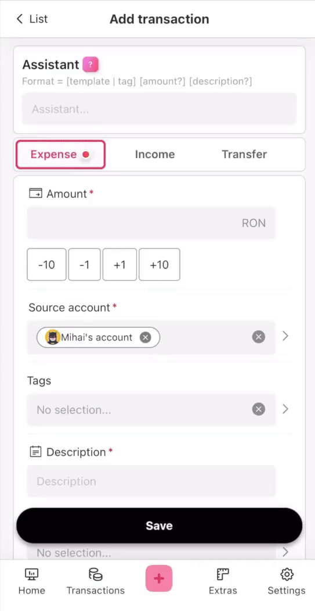

<div align="center">

</div>


<p align="center">
  <i>A delightful Firefly III companion web app for effortless transaction tracking</i>
</p>

<p align="center">
<a href="docs/installation.md">Installation</a>
·
<a href="https://github.com/cioraneanu/firefly-pico/issues">Suggestion / bug?</a>
·
<a href="docs/contribute.md">Contribute</a>
·
<a href="docs/architecture.md">Architecture</a>
</p>

<h1></h1>

<div align="center">

</div>


## About 💡
For several years I've enjoyed tracking my expenses in proprietary mobile apps 
but after getting into self-hosting I've wondered if there is an alternative that 
gives me the same functionality without losing control over my data.
I've came across Firefly III and I instantly fell in love with all of its features. 
Seeing that it offers a REST API I've decided to play with it and make a web app that feels mobile native.
I also wanted to convince my significant other to use it and so I had to go for the extremely challenging “Wife Approval Certification”.
That meant making the expense tracking process as short as possible all while still using tags and categories because who doesn't love some nice reports :innocent:

Several (bad) ideas later I've come to this version. A transaction assistant :tophat:

<div>
  
</div>

| Action                                                                          | Result                                                                                                                                                                                                                                                                                                                                                                                   |
|---------------------------------------------------------------------------------|------------------------------------------------------------------------------------------------------------------------------------------------------------------------------------------------------------------------------------------------------------------------------------------------------------------------------------------------------------------------------------------|
| - Partially write the name of a "tag" + "amount".<br>- Hit "Save". You're done!<br>(Ex. "elctr 28") | - Source account is preselected in Settings.<br>- Date is automatically set to "now"<br>- Fuzzy search found a tag with name close to what you typed ("electricity"). It also selected all of its parent tags.<br>- Category is selected by matching it to one of the tags above.<br>- The description field is copied from the child tag. <br> [Assistant details](./docs/assistant.md) |


## 🚀 Features
- ✅ Beautiful clean minimalistic UI :fire:
- ✅ Optimized for mobile :iphone:
- ✅ The assistant makes recording expenses feel like magic :sparkles:
- ✅ Expand Firefly data with icons for all resources :art:
- ✅ Expand Firefly "tags" with the option of subtags for better granularity
- ✅ Add "templates" to make auto-completing fields a breeze :loudspeaker:
- ✅ Beautiful dashboard making it easy to keep an eye on everything that matters :chart_with_upwards_trend:
- ✅ Lots of tweaks and settings :wrench:
- ✅ Free and open-source


## My setup
Firefly is very flexible and that can leave people unsure about how they should organise things.
This is by no means the only / best way to do, but it's what works for me:
```
- Create asset accounts for everything (ex. one for every family member, one for each savings account). It's easier to not use any revenue/expense accounts; that way they will be threated as "cash" and you'll have one less field to fill inside transactions
- Create your big, general "categories" (ex. Bills, Food, Fun, Transportation etc.)
- Create your root tags with names identical to the "categories" above (ex. Bills, Food, Fun, Transportation etc.) (This is useful because selecting a "tag" will automatically select the "category".)
- Create your child tags for granularity (ex. Electricity, Heating, Internet with the parent tag Bills). It's a good idea to remember these names and use them with the assistant. 
- Create a tag called "todo", and set "Mark as to-do" to Yes. Add this tag to any transaction that will be edited later. Ex. You paid dinner for multiple people and some will give you the money back later. Or you buy multiple shoes and return some of them. All these transactions will show up on your dashboard.
- Go to Settings -> New transaction defaults -> Set your default source account. 
  - (Optionally) If there are multiple users sharing an account you can create separate "tags" with their names. Then everyone can select their own for the "Auto tags" field.
- Identify any transactions that you perform often but cannot be turned into "Reapeating transactions" because of date irregularities. Create "templates" for them.

- Finally make the process of starting the app faster:
  - [iOS] Create a home screen shortcut: open the app in Safari -> share icon -> Add to Homescreen. The app will also show up in the global iOS search
  - [iOS] [Optional] Add double tap shortcut: 
    - Open Shortcuts app -> + -> Add action -> search for "Open URLs" -> Enter the pico deployment URL -> Tap toolbar and rename it to "Open Pico"
    - Open Settings -> Accesibility -> Touch -> Back tap -> Double tap -> Select the shortcut created above.
```


## 📑 Notes
- Firefly-Pico does NOT intend on replacing the Firefly GUI. My main focus is to optimize the daily interactions and leave more general config for the mother app ^_^.
- Split transactions will show up as read-only, and you cannot create them inside Pico. Separate transactions make more sense to me.


## :coffee: Support
If you enjoy Firefly-Pico please give this repository a star ⭐️.

## :crown: Attribution
Just like Firefly III this is licensed under the [GNU Affero General Public License v3](./LICENSE).

- Developed by Mihai Cioraneanu
- Using [Laravel](https://laravel.com/) and [Nuxt](https://nuxt.com/)
- Consuming the [Firefly III](https://www.firefly-iii.org) REST API
- With a custom UI theme based on [Vant](https://vant-ui.github.io)
- Exchange rates powered by [Exchange Rate API](https://www.exchangerate-api.com)

- IconPacks: [Tablr Icons](https://tabler.io/icons)
- IconPacks: [Fluent UI System Icons](https://github.com/microsoft/fluentui)
- IconPacks: [Circle Avatar Vectors by Laura Reen](https://www.svgrepo.com/author/Laura%20Reen)
- IconPacks: [SVG Repo](https://www.svgrepo.com/)
- Illustrations: [unDraw](https://undraw.co)