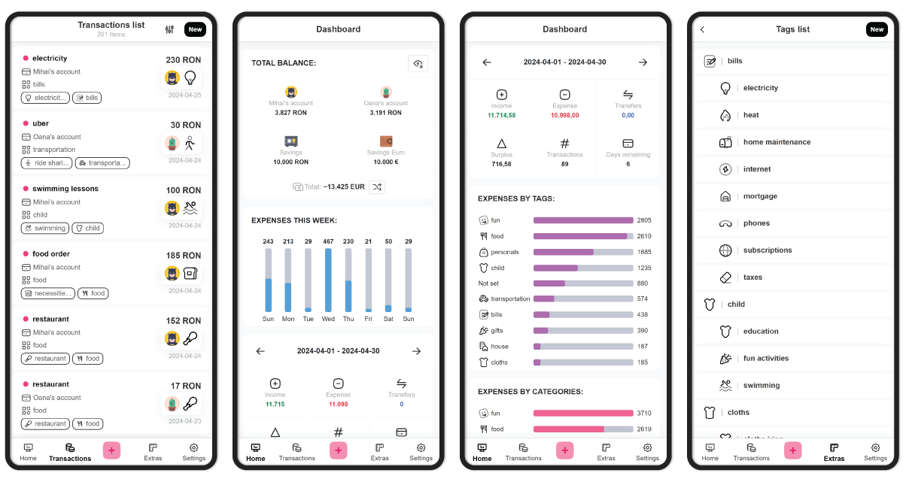
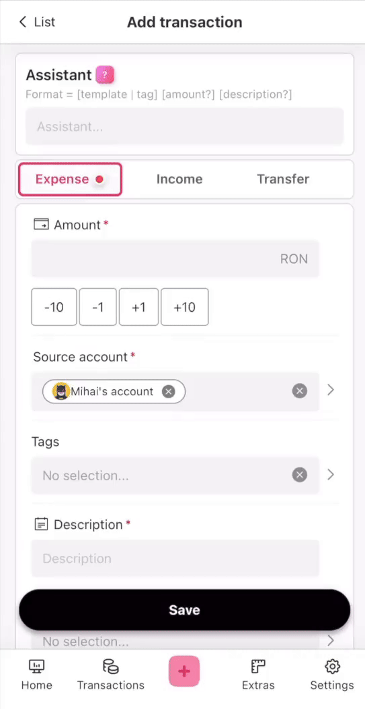

  

  <i>A delightful Firefly III companion web app for effortless transaction tracking</i>

<a href="https://cioraneanu.github.io/firefly-pico-docs">Documentation</a>
·
<a href="https://cioraneanu.github.io/firefly-pico-docs/installation/docker">Installation</a>

  
  
  

<h1></h1>

## 💡About 
For several years I've enjoyed tracking my expenses in proprietary mobile apps 
but after getting into self-hosting I've wondered if there is an alternative that 
gives me the same functionality without losing control over my data.
I've came across Firefly III and I instantly fell in love with all of its features. 
Seeing that it offers a REST API I've decided to play with it and make a web app that feels mobile native.
I also wanted to convince my significant other to use it and so I had to go for the extremely challenging “Wife Approval Certification”.
That meant making the expense tracking process as short as possible all while still using tags and categories because who doesn't love some nice reports :innocent:

Several (bad) ideas later I've come to this version. A transaction assistant :tophat:

  

## 🚀 Features
- ✅ Beautiful clean minimalistic UI :fire: subtle animations and dark-theme support :first_quarter_moon_with_face: 
- ✅ Optimized for mobile, with PWA support for a native feel :iphone:
- ✅ The Assistant makes recording an expense feel like magic :sparkles:
- ✅ Expand Firefly data with icons for all resources :art:
- ✅ Expand Firefly "tags" with the option of subtags for better granularity
- ✅ Add "templates" to make auto-completing fields a breeze :loudspeaker:
- ✅ Beautiful dashboard making it easy to keep an eye on everything that matters :chart_with_upwards_trend:
- ✅ Lots of tweaks and settings :wrench:
- ✅ Free and open-source

## :coffee: Support
If you enjoy Firefly-Pico please give this repository a star ⭐️.

## :crown: Attribution
Just like Firefly III this is licensed under the [GNU Affero General Public License v3](./LICENSE).

- Developed by Mihai Cioraneanu
- Using [Laravel](https://laravel.com/) and [Nuxt](https://nuxt.com/)
- Consuming the [Firefly III](https://www.firefly-iii.org) REST API
- With a custom UI theme based on [Vant](https://vant-ui.github.io)
- Exchange rates powered by [Exchange Rate API](https://www.exchangerate-api.com)
- IconPacks: [Tablr Icons](https://tabler.io/icons) · [Fluent UI System Icons](https://github.com/microsoft/fluentui) · [Circle Avatar Vectors by Laura Reen](https://www.svgrepo.com/author/Laura%20Reen) 
· [SVG Repo](https://www.svgrepo.com/) · [Freepik](https://www.freepik.com/)
- Illustrations: [unDraw](https://undraw.co)
