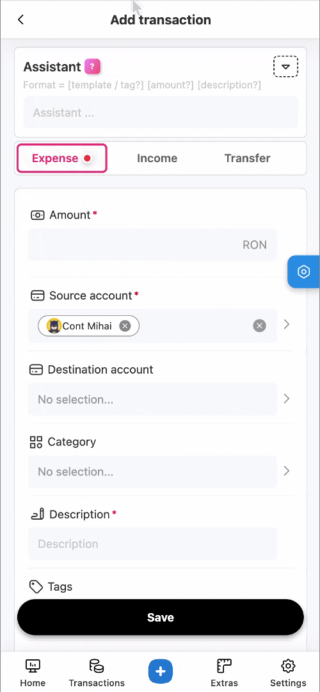

  

  <i>A delightful Firefly III companion web app for effortless transaction tracking</i>

<a href="https://cioraneanu.github.io/firefly-pico-docs">Documentation</a>
·
<a href="https://cioraneanu.github.io/firefly-pico-docs/installation/docker">Installation</a>

  
  
  

<h1></h1>

## 💡About 
**Firefly-Pico** is a mobile-optimized, highly responsive web application designed as a **[Firefly III](https://github.com/firefly-iii/firefly-iii)** companion app. 

It is built with a focus on speed and ease of use,
allowing you to quickly log expenses, organize tags, and keep track of your finances
on the go, all while maintaining completely private control over your own data.

Apart from the sleek interface, it augments **Firefly III** with custom entity icons,
support for sub-tags, and "templates" for auto-filling the transaction form.  

Last but not least, it also comes with a smart "assistant" which makes recording expenses a breeze 🎉:

  

Check out the **[full documentation](https://cioraneanu.github.io/firefly-pico-docs)**.

## 🚀 Features
- ✅ Beautiful clean minimalistic UI :fire: subtle animations and dark-theme support :first_quarter_moon_with_face: 
- ✅ Optimized for mobile, with PWA support for a native feel :iphone:
- ✅ The Assistant makes recording an expense feel like magic :sparkles:
- ✅ Expand Firefly data with icons for all resources :art:
- ✅ Expand Firefly "tags" with the option of subtags for better granularity
- ✅ Add "templates" to make auto-completing fields a breeze :loudspeaker:
- ✅ Beautiful dashboard making it easy to keep an eye on everything that matters :chart_with_upwards_trend:
- ✅ Lots of tweaks and settings :wrench:
- ✅ Free and open-source

## :coffee: Support
If you enjoy Firefly-Pico please give this repository a star ⭐️.
